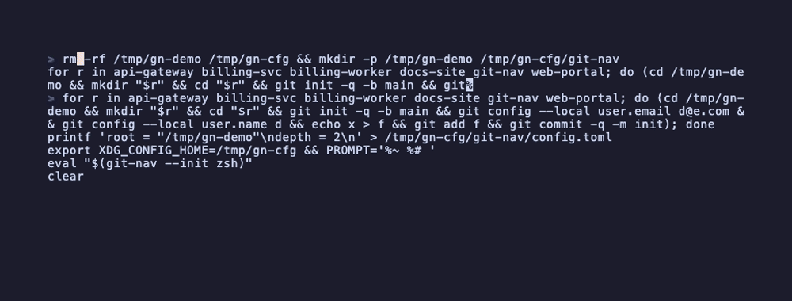

# git-nav

[](https://github.com/oskarizu/git-nav-rs/actions/workflows/ci.yml)
[](https://github.com/oskarizu/git-nav-rs/releases)
[](https://crates.io/crates/git-nav)
[](https://crates.io/crates/git-nav)
[](https://docs.rs/git-nav)
[](#license)

A fast, keyboard-driven navigator for your local git repositories.

`git-nav` walks a configured root, gathers status for every git repo it
finds (in parallel), and shows an inline TUI where you can filter, pick
a repo with the arrow keys, and `cd` into it. The picker sits at the
bottom of your terminal (like fzf) — no fullscreen takeover.



<sub>Regenerate the demo with `vhs docs/demo.tape` — see [docs/demo.tape](docs/demo.tape).</sub>

## Install

Requires Rust ≥ 1.85 (for the 2024 edition).

From crates.io:

```sh
cargo install git-nav
```

Or straight from the git repository:

```sh
cargo install --git https://github.com/oskarizu/git-nav-rs
```

Or from a local checkout:

```sh
cargo install --path .
```

Then wire up the shell function so `cd` actually happens — pick one:

**Option A — automatic**, appends the wrapper to your rc file (idempotent,
re-run any time to refresh the baked-in path):

```sh
git-nav --install-shell
exec $SHELL -l
gnav
```

**Option B — manual `eval`**, add this line to your `~/.zshrc`,
`~/.bashrc`, or `~/.config/fish/config.fish`:

```sh
eval "$(git-nav --init zsh)"    # or bash / fish
```

Both produce the exact same wrapper. A writes it to disk once, B
re-evaluates it fresh on every shell start (sub-millisecond either way).

## Why the shell wrapper?

A child process can't change its parent shell's directory. `git-nav`
prints the chosen repo path to stdout; the `gnav` wrapper captures it
and runs `cd`. If you invoke the binary directly (no wrapper), it prints
a hint pointing you at `--install-shell` rather than silently doing
nothing.

## Configuration

On first run, `git-nav` prompts for the top-level directory to scan
and stores your answer at `~/.config/git-nav/config.toml`
(`$XDG_CONFIG_HOME/git-nav/config.toml` if set):

```toml
root = "/Users/you/projects"
depth = 4
```

- `git-nav --reset` re-runs the prompt.
- `git-nav --config-path` prints the file location.
- `git-nav --root PATH` and `--depth N` override the file per-invocation.

## Keys (TUI)

| Key                    | Action                    |
| ---------------------- | ------------------------- |
| `↑` / `↓`              | move selection            |
| `PgUp` / `PgDn`        | jump 10 rows              |
| `Home` / `End`         | jump to first / last      |
| any printable char     | narrow the fuzzy filter   |
| `Backspace`            | shrink the filter         |
| `Enter`                | pick and `cd`             |
| `Esc` / `Ctrl-C`       | quit without picking      |

The filter is a case-insensitive subsequence match across REPO, ORG,
BRANCH, and AUTHOR — typing `bsv` matches `billing-svc`, typing your
own name narrows to repos you touched last.

## Performance

Repo discovery and per-repo `git status` are parallel (rayon). On my
laptop, 50 repos with ~100 git subprocesses land in ~275ms end-to-end.

## Non-TTY fallback

If stderr isn't a TTY (piped, in a script, etc.) `git-nav` falls back
to printing a plain table and reading a number on stdin — the original
Python-era behavior.

## Development

```sh
cargo build --release          # builds to target/release/git-nav
cargo test                     # unit + integration tests
```

The code lives in small modules under `src/`:

- `cli` — arg parser
- `config` — TOML config load / save / first-run prompt
- `scanner` — parallel filesystem walk
- `git` — `RepoInfo` + git subprocess calls (also parallel)
- `ui::tui` — ratatui inline selector (bottom-anchored, sized to fit)
- `ui::render` — plain-text table (non-TTY fallback)
- `ui::fuzzy` — subsequence matcher
- `shell` — `--init` snippets + `--install-shell`

## License

Dual-licensed under either of

- Apache License, Version 2.0 ([LICENSE-APACHE](LICENSE-APACHE))
- MIT license ([LICENSE-MIT](LICENSE-MIT))

at your option.
